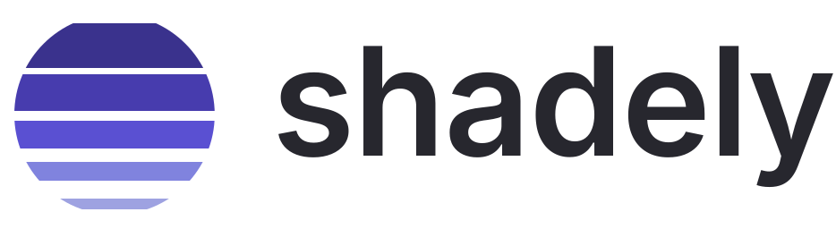
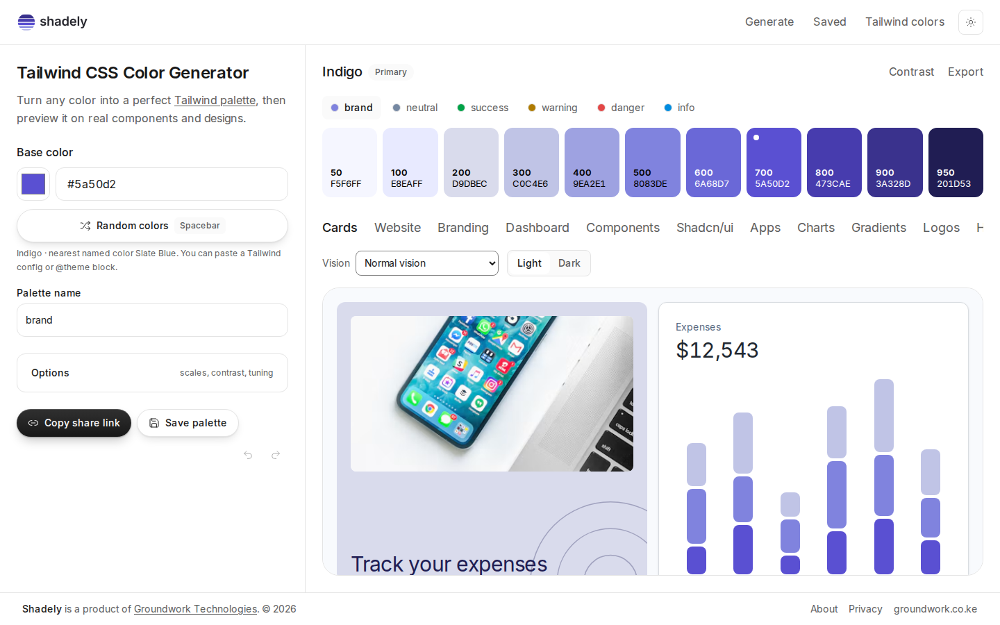

<div align="center">

<picture>
  <source media="(prefers-color-scheme: dark)" srcset="public/brand/shadely-logo-dark.svg">
  
</picture>

**Turn any color into a perfect Tailwind palette, then preview it on real components and designs.**

<br>

[](https://nextjs.org)
[](https://react.dev)
[](https://www.typescriptlang.org)
[](https://tailwindcss.com)
[](LICENSE)
[](https://oklch.com)
[](#quality)
[](#quality)
[](#privacy)
[](https://groundwork.co.ke)

[Live site](https://shadely.groundwork.co.ke) &nbsp;·&nbsp; [Features](#features) &nbsp;·&nbsp; [How it works](#how-it-works) &nbsp;·&nbsp; [Export](#export-everywhere) &nbsp;·&nbsp; [Quick start](#quick-start) &nbsp;·&nbsp; [Project layout](#project-layout) &nbsp;·&nbsp; [Brand](docs/brand.md)

<br>



</div>

<br>

## Why Shadely

Picking one brand color is easy. Turning it into eleven shades that look even, pass contrast, and still work in a real interface is not. Shadely does that part: enter a color, get a complete Tailwind scale, see it on real screens, and copy it into your project.

- **It keeps your color.** Your exact color lands on the shade it naturally belongs to. A light yellow is not forced to 500, and a deep navy is not made brighter than it is.
- **Even in every hue.** Scales are built in OKLCH, so a step in lightness looks the same size in blue, green and yellow.
- **You see it before you ship it.** Eleven live preview pages in light and dark, built from your palette.
- **You can check it.** WCAG 2.2 and APCA contrast, every shade against every other.
- **No sign-up.** Everything runs in your browser.

## Features

<table>
<tr>
<td width="50%" valign="top">

### Palette engine
- 50 to 950 scale from one color, in OKLCH
- Neutral scale: tinted to your brand, pure gray, or any Tailwind neutral family
- Extra scales from the brand hue: analogous, complementary, split, triadic, tetradic, square
- Success, warning, danger and info scales
- Real color names, such as "Indigo", with the nearest named color
- Paste a Tailwind config or `@theme` block to start from an existing palette
- Chroma and lightness tuning, undo and redo

</td>
<td width="50%" valign="top">

### Accessibility
- WCAG 2.2 and APCA, switchable
- Best text color for every shade
- Full pairing matrix: every shade as text on every shade
- One switch to adjust shades until they pass AA, without changing your base color
- Color-vision simulation: protanopia, deuteranopia, tritanopia, achromatopsia
- shadcn/ui theme tokens whose text and background pairs all reach AA, in light and dark

</td>
</tr>
</table>

### Preview on real designs

Cards, website, branding, dashboard, components, shadcn/ui, apps, charts, gradients, logos and headings. Each page is built from your palette and switches between light and dark. Contrast and export stay out of the way until you ask for them.

## How it works

1. **Your color goes in** as hex, `rgb()`, `hsl()` or `oklch()`.
2. **Shadely finds its place.** It picks the stop whose lightness is closest, and pins your exact color there.
3. **The other shades follow curves modelled on Tailwind's own palettes** for lightness and chroma, in OKLCH, so the steps look even.
4. **Colors that do not fit on screen** lose a little chroma and keep their lightness and hue, instead of being clipped.
5. **Every number you see** is computed from the exact hex you export.

The color engine is plain TypeScript with no runtime dependencies and no UI imports. The rule is enforced by ESLint, so the engine can be reused on its own.

## Export everywhere

Fourteen formats, plus one ZIP with all of them.

| Web | Design tokens | Mobile |
|---|---|---|
| Tailwind v4 `@theme` | shadcn/ui theme (light and dark) | Flutter (Dart) |
| Tailwind v3 config | JSON | Android `colors.xml` |
| CSS variables | W3C design tokens | Jetpack Compose |
| Modern CSS (OKLCH with `light-dark()`) | Tokens Studio | iOS (SwiftUI and asset catalog) |
| SCSS | Style Dictionary | |

Colors can be written as OKLCH, hex, HSL, RGB or Display-P3, where the format allows it.

## Quick start

You need Node.js 22 or newer.

```bash
npm install
npm run dev
```

Open <http://localhost:3000>.

| Command | What it does |
|---|---|
| `npm run dev` | Start the dev server |
| `npm run build` | Production build |
| `npm test` | Unit tests (Vitest): engine, exports, design tokens, copy and SEO rules |
| `npm run e2e` | Browser tests (Playwright), including axe accessibility scans and a JavaScript size budget. Needs a build first |
| `npm run lint` | ESLint |
| `npm run typecheck` | TypeScript, strict |

The site address defaults to https://shadely.groundwork.co.ke. Set `NEXT_PUBLIC_SITE_URL` to use a different one for canonical links, the sitemap and share images. See `.env.example`.

### Keyboard

`Space` random color &nbsp;·&nbsp; `Ctrl/Cmd+Z` undo &nbsp;·&nbsp; `Shift+Ctrl/Cmd+Z` redo

## Project layout

```text
src/
  engine/        Pure TypeScript color engine: scales, gamut, contrast, naming, exports
  components/    Workspace, previews, site chrome, UI primitives
  app/           Next.js App Router pages, icons and share images
  lib/           Site config, SEO data, design helpers
public/brand/    Logo, mark, app icon and favicon files (SVG and PNG)
docs/            Research, plan, design audit, brand guide, feature roadmap
e2e/             Playwright tests
```

## Quality

- **Engine tests** cover color conversion against an independent library, gamut mapping, scale properties across thousands of generated colors, contrast math, every export format, and the share-link format.
- **Browser tests** cover the main flows, every preview page at phone, tablet and desktop widths, and the no-scroll desktop layout.
- **Accessibility** is checked with axe on every page and every preview, in light and dark.
- **Performance budget**: the first-load JavaScript size is measured in the test suite and fails the test run if it grows past the limit.
- **Rules as tests**: design tokens must keep their contrast, titles and descriptions must follow the SEO rules, and the copy must follow the writing rules.

## Privacy

Shadely has no accounts, no analytics and no uploads. Your palette lives in the page address, so a link you share contains it. Saved palettes and your light or dark choice stay in your browser. The preview pages load photos from Unsplash. Details are on the in-app Privacy page.

## Docs

- [Brand guide](docs/brand.md): logo, color system and usage rules
- [Feature roadmap](docs/feature-roadmap.md): what is built and what could come next
- [Design audit](docs/design-audit.md): the typography and design token decisions
- [Research](docs/research) and [plan](docs/plan): how the product and the algorithm were designed

## Credits

Built by [Groundwork Technologies](https://groundwork.co.ke). Preview photos are from [Unsplash](https://unsplash.com). Icons are from [Lucide](https://lucide.dev).
